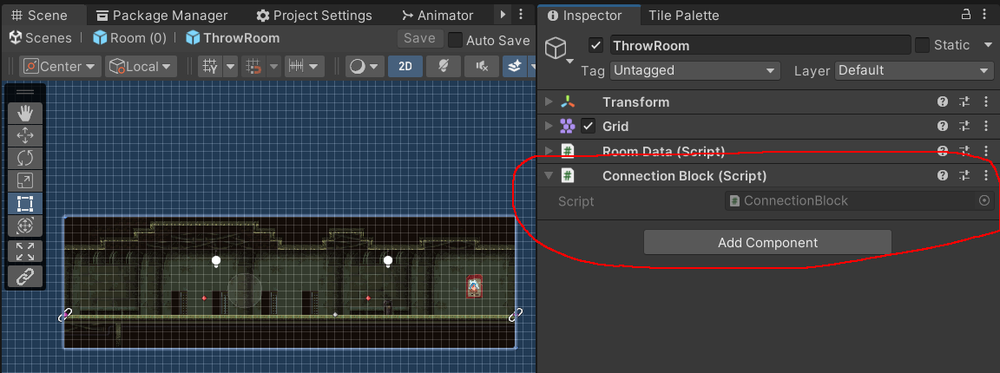
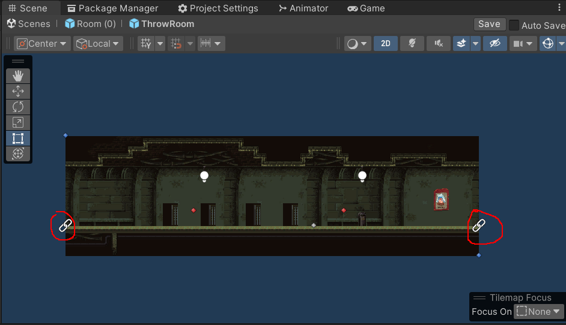
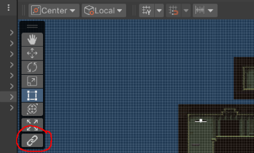
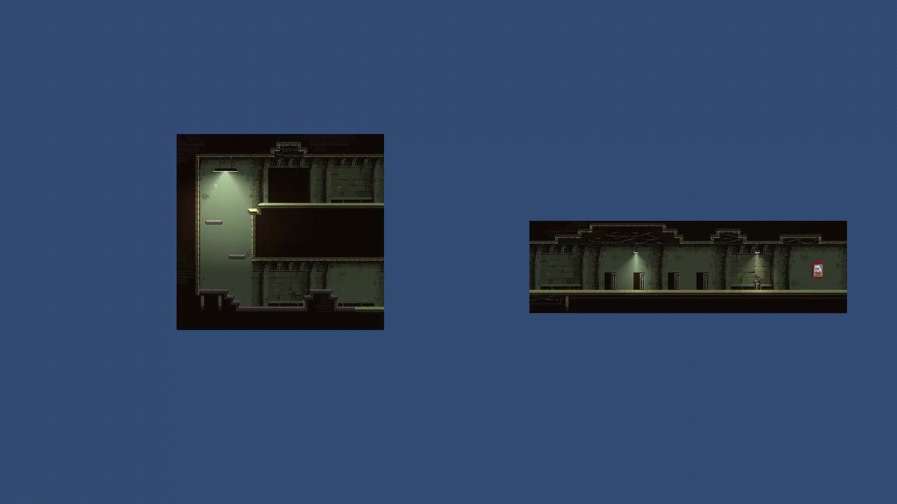

# EditorConnectionTool

EditorConnectionTool используется для того чтобы из малых блоков составлять сложные конструкции, 
соединяя блоки автоматически, не проверяя вручную то насколько точно блоки соединены.

## Использование EditorConnectionTool:

1. Прикрепляете компонент ConnectionBlock к объекту, у которого будут точки креплений.

2. Создание креплений:
- Используйте префаб "Connector" (рассположение: Assets/EditorTools/EditorConnectionTool/...). 
Делаете необходимое кол-во дочерних объектов из этого префаба и распологаете их где вам надо.
        

- Если готовый префаб не подходит: Создаете дочерние объекты и к каждому прикрепляете Connector. 
Теперь они будут считаться креплениями. (желательно поменять иконки этих объектов на ConnectorIcon, чтобы крепления было видно на сцене).
    
3. Выделяете объект с ConnectionBlock.
 
4. В списке инструментов сцены (поумолчанию расположены в окне сцены слева вверху) выбирааете нижний инструмент 
(иконка двух звений цепи, при наведении на него всплывет надпись "Connection Tool").

5. Перетаскиваете объект к другому объекту с скреплениями и они автоматически соединятся в местах креплений.

## Настрока EditorConnectionTool

По умолчанию максимальная дальность для стыковки = 5f, чтобы её изменить надо открыть файл EditorConnectionTool.cs 
(рассположение: Assets/EditorTools/EditorConnectionTool/...) и поменять значение переменной MaxConnectionDistance.